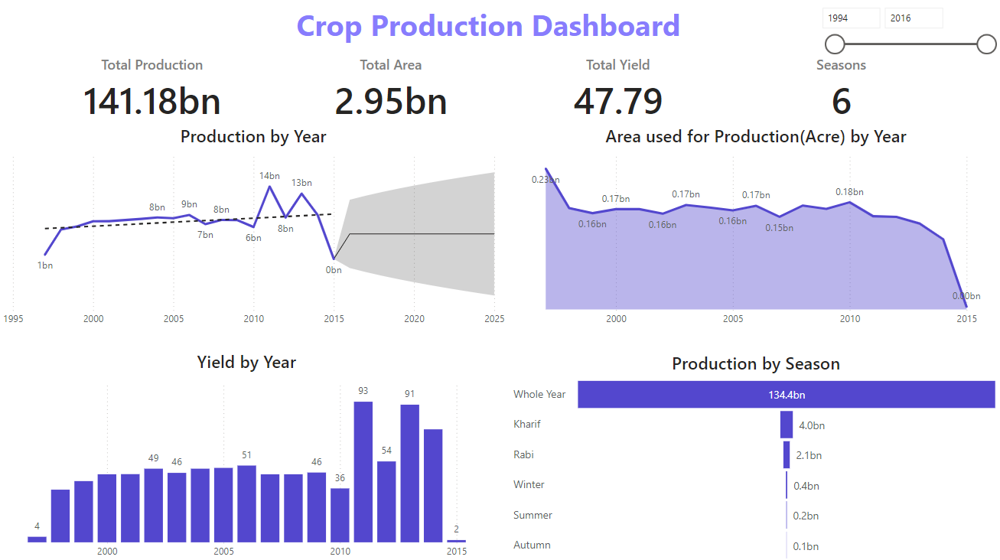
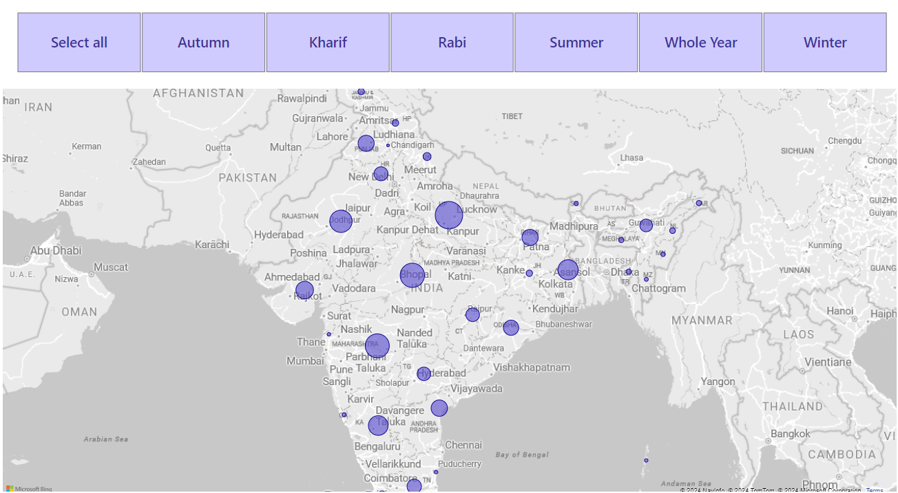

# Crop_Production_Dashboard
This repository provides a step-by-step guide to analyzing agricultural data using Power BI. The dataset includes information on crop production across various states and districts, allowing for the creation of insightful visualizations and metrics.

Dataset Description
The dataset contains the following columns:

State Name: Name of the state
District Name: Name of the district
Crop Year: Year of crop production
Season: Season during which the crop was grown
Crop: Type of crop
Area: Area under cultivation (in Acres)
Production: Crop production

Data Preparation:
- ETL in Power Query
- Created a measure called Yield
- Created a data table and built relation between tables
- Used Sync Filters

Tools: Power BI